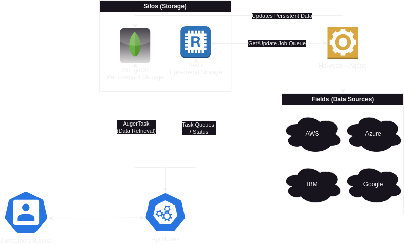

# CloudHarvestCoreTasks
This repository contains the base and common tasks found in CloudHarvest. Tasks and TaskChains are a fundamental part of the CloudHarvest framework, and are used to define workflows in every layer of the application.

- [CloudHarvestCoreTasks](#cloudharvestcoretasks)
- [Terminology](#terminology)
  - [Appropriated Agricultural Terms](#appropriated-agricultural-terms)
  - [Project Terms](#project-terms)
- [Task Chains](#task-chains)
- [Tasks](#tasks)
  - [Available Tasks](#available-tasks)
- [License](#license)

# Terminology
Harvest takes its name from the Combine Harvester, a machine which automates the process of harvesting crops. 
In the same way, Harvest automates the process of collecting, processing, and reporting data. The following terms are 
used throughout the Harvest documentation and source code.

## Appropriated Agricultural Terms
The project's naming conventions are inspired by the agricultural process of harvesting crops.

| Agricultural Term     | Technology Term       | Definition                                                                                                                         |
|-----------------------|-----------------------|------------------------------------------------------------------------------------------------------------------------------------|
| `field`               | Data Source           | Any compatible information source, such as the AWS API or the contents of a database or file which will be stored in a `silo`.     |
| (combine) `harvester` | Data Collection Agent | A system which collects data from `fields` and places it in `silos`.                                                               | 
| `silo`                | Data Storage          | Where data lives until it is needed by the application or user, or purged.                                                         |
| `auger`               | Data Retrieval        | A process or system which retrieves data from a `silo`. Typically the API when it leverages the [`AugerTask`](docs/tasks/auger.md) |
| `consumer`            | End User              | The entity which uses the data.                                                                                                    |

## Project Terms
| Term               | Definition                                                                                                                      |
|--------------------|---------------------------------------------------------------------------------------------------------------------------------|
| Harvest            | The name of the project. Harvest is a data collection, processing, and reporting framework.                                     |
| Task Chain         | A JSON or YAML file which describes the Tasks to be executed. Task Chains are used to define a workflow.                        |
| Task               | The basic unit of work in Harvest. Tasks are designed to be modular and reusable, and are used to build more complex workflows. |
| Persistent Storage | A MongoDB database which stores data for reporting.                                                                             |
| Ephemeral Storage  | A Redis database which stores data for temporary use.                                                                           |
| Agent              | A system which collects data from `fields`.                                                                                     |



# Task Chains
A [TaskChain](docs/task_chains/base.md) is a JSON or YAML file which describes the Tasks to be executed. Task Chains are used to define a workflow.

Consider this annotated excerpt from the [CloudHarvestApi reports collection](https://github.com/Cloud-Harvest/CloudHarvestApi/blob/main/CloudHarvestApi/api/blueprints/reports/reports/harvest/nodes.yaml):
```yaml
report:                                                       # This is the TaskChain's Chain identifier
  name: 'Report'                                              # Arbitrary name of the TaskChain
  description: |                                              # An arbitrary description of the TaskChain
    This TaskChain generates a 
    report of the API nodes
  tasks:                                                      # This is the list of tasks to be executed
    - cache_aggregate:                                        # This is the first task to be executed
      name: query harvest.api_nodes                           # The first Task's name
      description: 'Get information about the API nodes'      # ...and description                 
      result_as: result                                       # This is the name of the result which will be available to other tasks within the same TaskChain if this Task completes successfully
      on:                                                     # This is a list of tasks to be executed when the task reaches one of four states: complete, error, skipped, and start
        complete:
          - task: ...                                         # This is a task to be executed when the task completes
      error:
          - task: ...                                         # This is a task to be executed when the task errors
      when: "{{ var }} == 'value'"                            # A jinja2 template which must evaluate to True in order for the task to run 
```

# Tasks
A Task is the basic unit of work in CloudHarvest. Tasks are designed to be modular and reusable, and are used to build more
complex workflows (ie `TaskChain`s). Tasks are designed to be as simple as possible, and are generally performed
sequentially within their TaskChain, although there are specialized Tasks which run asynchronously.

## Available Tasks
This module provides many common tasks which are used throughout the CloudHarvest application.
These tasks are designed to be modular and reusable, and are used to build more complex workflows.

| Calling Name                            | Class Name             | Description                                                                                                                             |
|-----------------------------------------|------------------------|-----------------------------------------------------------------------------------------------------------------------------------------|
| [BaseTask](docs/tasks/base_task.md)     | `BaseTask`             | All other tasks inherit from the BaseClass. The BaseTask cannot be called directly within a TaskChain's `tasks` list.                   |
| [BaseDataTask](docs/tasks/base_data.md) | `BaseDataTask`         | A Task which uses a `connect()` method to use a remote data source provider, such as a database. `mongo` and `redis` tasks use this.    |
|                                         |                        |                                                                                                                                         |
| [`auger`](docs/tasks/auger.md)          | `AugerTask`            | A task which retrieves data from the Persistent Silo based on dynamic, user-provided parameters.                                        |
| [`dummy`](docs/tasks/dummy.md)          | `DummyTask`            | A Task which does nothing. This Task is useful for testing and debugging.                                                               |
| [`error`](docs/tasks/error.md)          | `ErrorTask`            | A Task which raises an error. This Task is useful for testing and debugging.                                                            |
| [`file`](docs/tasks/file.md)            | `FileTask`             | A Task which reads or writes a file.                                                                                                    |
| [`for_each`](docs/tasks/for_each.md)    | `ForEachTask`          | A Task which iterates over a list of items and executes a Task for each item.                                                           |
| [`mongo`](docs/tasks/mongo.md)          | `MongoTask`            | This Task connects to a Mongo database and performs some action.                                                                        |
| [`prune`](docs/tasks/prune.md)          | `PruneTask`            | A Task which cleans up memory by deleting the results from previous Tasks.                                                              |
| [`recordset`](docs/tasks/recordset.md)  | `HarvestRecordsetTask` | A Task which interacts with data stored as a [Harvest Recordset](CloudHarvestCoreTasks/data_model/README.md).                           |
| [`redis`](docs/tasks/redis.md)          | `RedisTask`            | This task connects to a Redis database and performs some operation.                                                                     |
| [`wait`](docs/tasks/wait.md)            | `WaitTask`             | A Task which waits for specific conditions to be met before continuing. Useful when running asynchronous Tasks using `blocking: False`. |

# License
Shield: [![CC BY-NC-SA 4.0][cc-by-nc-sa-shield]][cc-by-nc-sa]

This work is licensed under a
[Creative Commons Attribution-NonCommercial-ShareAlike 4.0 International License][cc-by-nc-sa].

[![CC BY-NC-SA 4.0][cc-by-nc-sa-image]][cc-by-nc-sa]

[cc-by-nc-sa]: http://creativecommons.org/licenses/by-nc-sa/4.0/
[cc-by-nc-sa-image]: https://licensebuttons.net/l/by-nc-sa/4.0/88x31.png
[cc-by-nc-sa-shield]: https://img.shields.io/badge/License-CC%20BY--NC--SA%204.0-lightgrey.svg